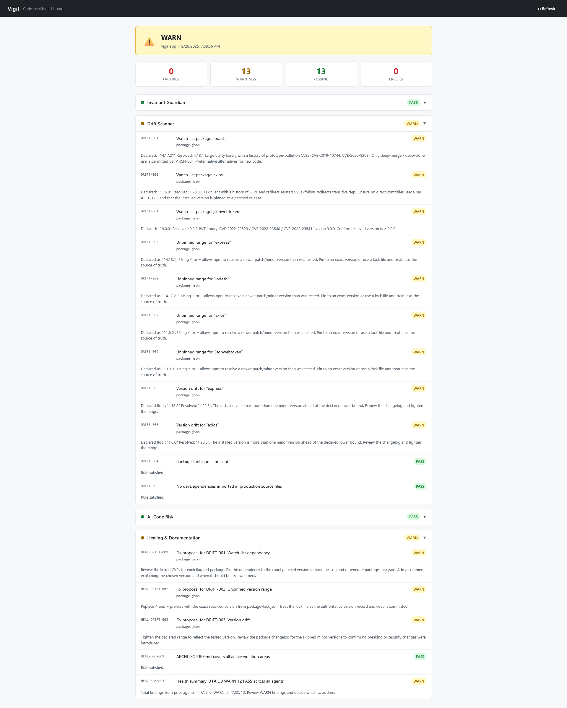
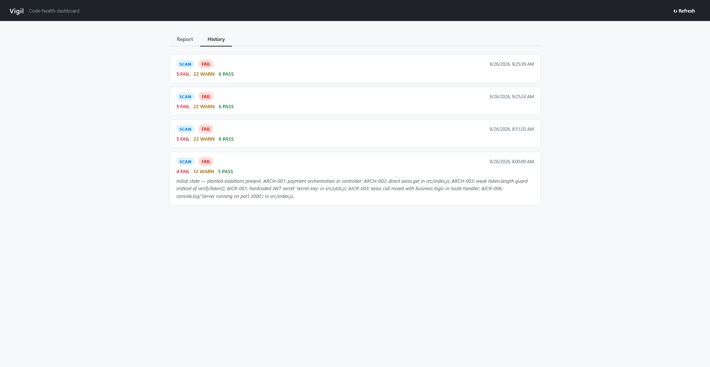

# Vigil – Living Architectural Immune System

A continuous multi-agent system built with **IBM Bob 2.0** that monitors a repository for three kinds of decay:

- dependency drift
- AI-generated code risk
- architectural invariant violations

Vigil scans the project, explains the impact, proposes the smallest safe fix, and can apply known patches from the CLI or a simple dashboard.

This project was built for the IBM Bob 2.0 Hackathon theme **Build with purpose using IBM Bob 2.0**, focused on the **application maintenance** workflow.

## Problem

Developer teams still lose time on maintenance work that existing tools handle poorly:

- Dependency updates and CVEs arrive without codebase-specific impact analysis
- AI-assisted coding introduces hidden coupling, weak auth checks, and hardcoded secrets
- Architectural rules written in docs are silently broken in source files

The result is slow review, rework, and preventable production risk.

## Solution

Vigil keeps a living model of the repository and runs four specialized agents under a Supervisor:

1. **Drift Scanner** — declared vs resolved dependencies, unpinned ranges, and watch-list packages
2. **AI-Code Risk Agent** — hardcoded secrets, inline auth, mixed I/O, unguarded async calls, and leftover console output
3. **Invariant Guardian** — enforces rules from `ARCHITECTURE.md` and `docs/invariants.md`
4. **Healing & Documentation Agent** — turns findings into concrete fix proposals and checks whether architecture docs still cover active rules

A deterministic fix engine can apply known safe patches. The same report is available from:

- CLI
- REST API
- Admin UI

## How IBM Bob 2.0 was used

IBM Bob IDE was the core development partner for this project.

- Full repository context was used to read `package.json`, source files, and architecture documents
- Agent mode, parallel tasks, and subagents were used to design and implement the Supervisor and the four Vigil agents
- Document understanding was used to extract architectural invariants from `ARCHITECTURE.md` and `docs/invariants.md`
- Bob task session summaries are included in `bob_sessions/` as required submission evidence

Bob was used to build and refine the system, not only to autocomplete snippets.

## Demo

Live dashboard: https://vigil-app--iamrichardneaver.replit.app

Dashboard screenshot:



History of scans and applied fixes:



Start the local dashboard with:

    node vigil/cli.js serve

Then open http://localhost:3000/


## Repository layout

```text
vigil-sample-app/
├── ARCHITECTURE.md
├── docs/invariants.md
├── src/
├── vigil/
│   ├── living-model.md
│   ├── agents/
│   ├── fixes/
│   ├── cli.js
│   ├── server.js
│   └── public/index.html
├── demo/
├── bob_sessions/
└── README.md
```

## Requirements

- Node.js 18+
- npm

Do not commit `node_modules`.

## Setup

```bash
git clone https://github.com/YOUR-USERNAME/vigil-sample-app.git
cd vigil-sample-app
npm install
```

## Commands

Scan the repository:

```bash
node vigil/cli.js scan --verbose
```

Show the last saved report:

```bash
node vigil/cli.js status
```

Preview safe fixes without writing files:

```bash
node vigil/cli.js fix --dry-run
```

Apply safe fixes:

```bash
node vigil/cli.js fix
```

Apply one rule only:

```bash
node vigil/cli.js fix --rule ARCH-002
```

Start the dashboard and API:

```bash
node vigil/cli.js serve
```
The dashboard includes the current report and a History tab of past scans and applied fixes.

Then open:

- Admin UI: http://localhost:3000/
- Report API: http://localhost:3000/api/vigil/report
- Health API: http://localhost:3000/api/vigil/health

The original agent entry point still works:

```bash
node vigil/agents/index.js --verbose
```

npm scripts:

```bash
npm run scan
npm run fix:dry
npm start
```

## API

| Method | Path | Purpose |
| ------ | ---- | ------- |
| GET | `/api/vigil/health` | Service health |
| GET | `/api/vigil/report` | Run agents and return the JSON report |
| POST | `/api/vigil/fix` | Apply or dry-run safe patches |

Examples:

```bash
curl http://localhost:3000/api/vigil/health
curl http://localhost:3000/api/vigil/report
curl -X POST http://localhost:3000/api/vigil/fix -H "Content-Type: application/json" -d "{\"dryRun\":true}"
```

## What the sample app contains

The sample app is a small Express service used as the codebase under watch. It ships with planted maintenance issues so judges can see Vigil detect and fix them:

- payment orchestration mixed into the controller
- a direct axios call from a route handler
- a weak inline token check
- a hardcoded JWT secret
- unpinned dependency ranges

Run `node vigil/cli.js scan --verbose` to see the FAIL and WARN findings.  
Run `node vigil/cli.js fix --dry-run` to preview the patches.  
Run `node vigil/cli.js fix` to apply the safe fixes, then scan again to see the FAIL count drop.

The dashboard History tab records those scans and applied fixes.

## Measurable impact

On this sample repository:

- A full maintenance review is reduced to one scan command
- Planted architectural and AI-code failures are detected with file and line evidence
- Safe fixes can be previewed or applied from the CLI or dashboard
- A second scan shows the FAIL count drop after fixes are applied
- Remaining items are explicit dependency warnings
- Scan and fix history is kept so the before/after trail is visible
- The scan returns exit code `1` when FAIL or ERROR exists, so it can be used in CI

## Hackathon evidence

Required Bob task session summaries are stored in `bob_sessions/`.

These screenshots document Bob usage for:

1. repository analysis and agent construction
2. CLI, API, UI, and fix-engine implementation
3. detector and status consistency fixes

## Data note

This repository uses only synthetic sample code created for the hackathon. It contains no client data, no personal information, and no confidential datasets.

## License

This hackathon prototype is provided as-is for evaluation.
